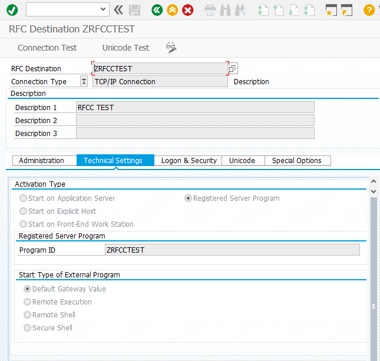

# C# RFC Server Example

Implementing an RFC server which can receive function calls from SAP requires the following steps:

1. Create a server object and set the necessary parameters: `GatewayHost`, `GatewayService`, `ProgramID`
2. Create or import one or more `FunctionCall` prototypes and install them using the `InstallFunction` method
3. Subscribe to the `IncomingCall` event
4. Run the server and wait for incoming calls. The server will run in another thread, so the main thread 
   can do other work, for example handling GUI updates.

```csharp
/// 
/// the run method sets up the server and starts it
/// 
void run()
{
    // set up RFC connection data
	srv = new NWRfcServer();
    srv.ProgramID = RFC_DESTINATION;
    srv.GatewayHost = GATEWAY_HOST;
    srv.GatewayService = GATEWAY_SERVICE;

    // import the function and install it in our server
	ImportFunctions();
    srv.InstallFunction(fn1);
    
    // set up event handlers
    srv.IncomingCall += OnIncomingCall;
    
	// start the server in a background thread
	srv.Serve();
        
    Console.WriteLine("Server running. Press key to stop...");
    Console.ReadLine();

	// shut down the server
    srv.Shutdown();
}

///
/// OnIncoming call is called by the server every time we receive
/// a function call. We fill in the required data and send it back
/// to the caller
///     
void OnIncomingCall(FunctionCall fn)
{
    switch (fn.Function)
    {
        case "BAPI_FLIGHT_GETLIST":
            // add some static rows 
            DateTime dt = DateTime.Now;
            for (int i = 1; i <= 10; i++)
            {
                RfcFields r = fn.Tables["FLIGHT_LIST"].Rows.AddRow();
                r["AIRLINEID"].value = "LH";
                r["AIRPORTFR"].value = "LAX";
                r["AIRPORTTO"].value = "FRA";
                r["CONNECTID"].value = i;
                r["FLIGHTDATE"].value = dt.AddDays(i);
            }
            break;
        default:
            // we don't know about this function, so we raise an exception
            fn.RaiseException("SYSTEM_ERROR", "");
            break;
    }
}
```

# Prerequisites

The RFC connection must be created in the SAP server using transaction `SM59`:



After defining the connection, start the server and use the "Connection Test"
button to test the connection.

To actually connect to your server and retrieve data, you have to write an 
ABAP report which calls the service. For `DESTINATION` use the name of the 
RFC destination from SM59:

```abap
REPORT  zrfcclient.

DATA: lt_flights TYPE TABLE OF bapisfldat,
      wa TYPE bapisfldat.

CALL FUNCTION 'BAPI_FLIGHT_GETLIST' DESTINATION 'ZRFCCTEST'
  EXPORTING
    airline     = 'LH'
  TABLES
    flight_list = lt_flights
  EXCEPTIONS
    OTHERS      = 1.

WRITE:/ 'RESULT', sy-subrc.

LOOP AT lt_flights INTO wa.
  WRITE:/ wa-airlineid, wa-connectid, wa-flightdate.

ENDLOOP.
```

